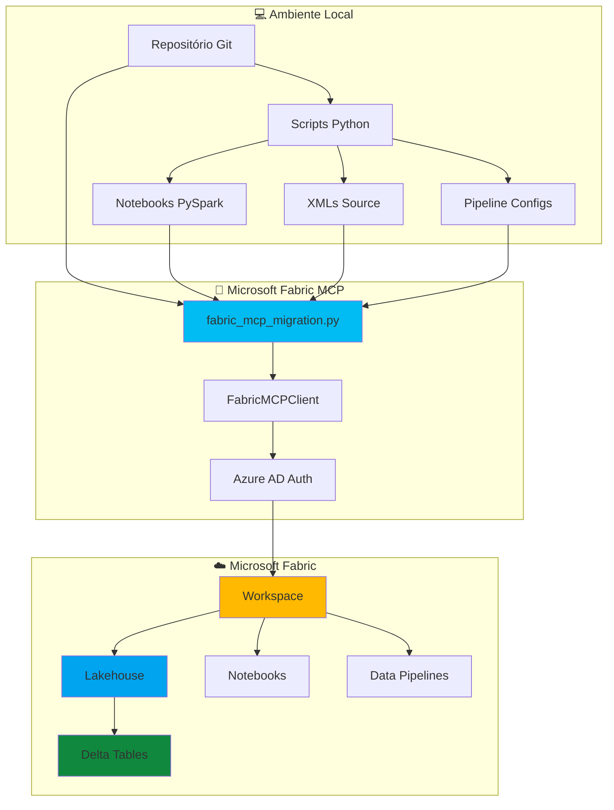
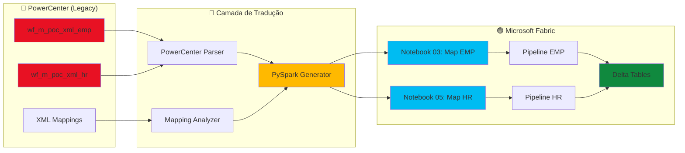
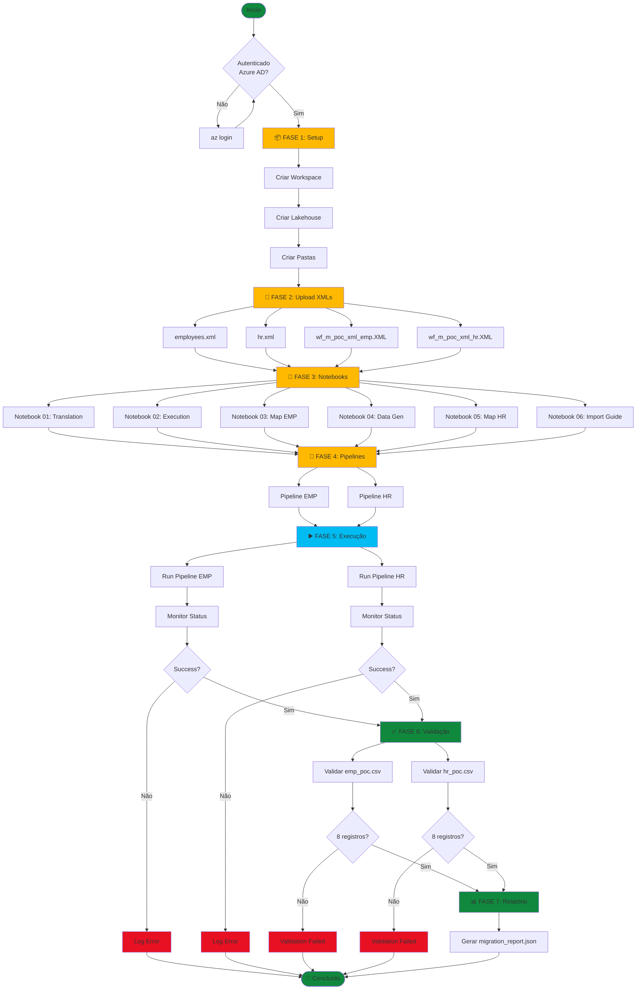
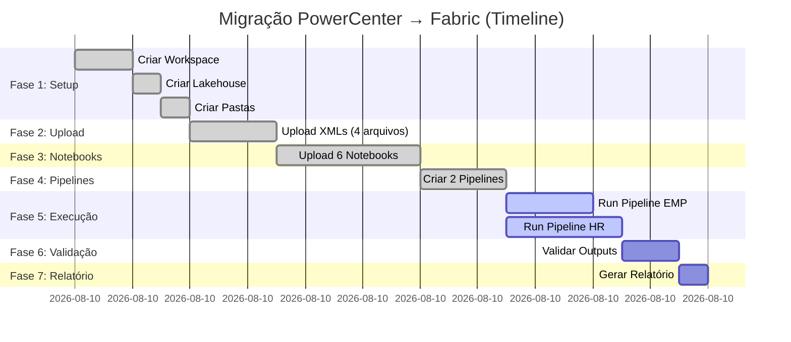
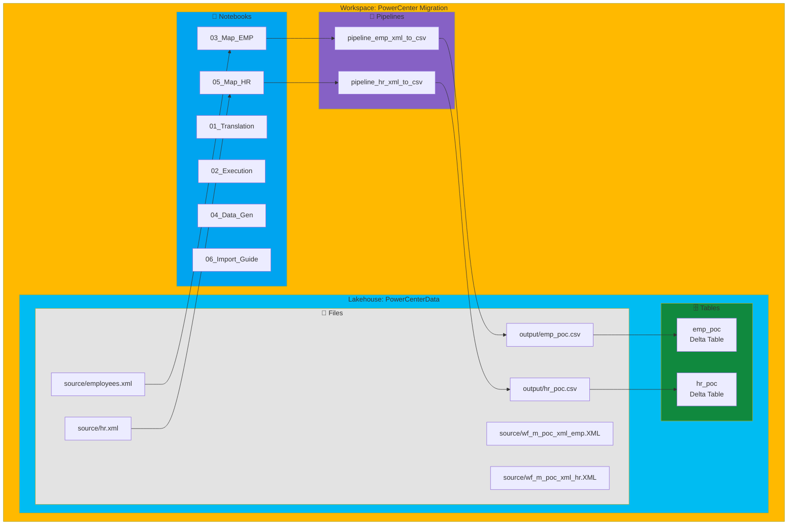
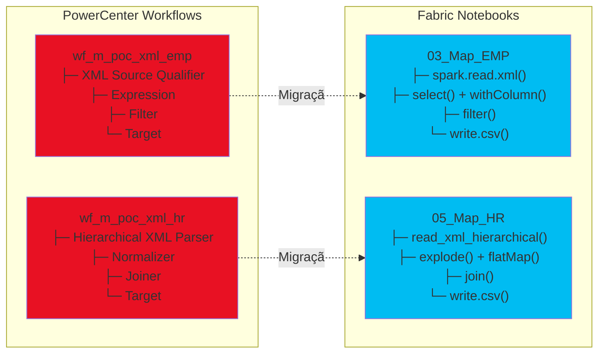
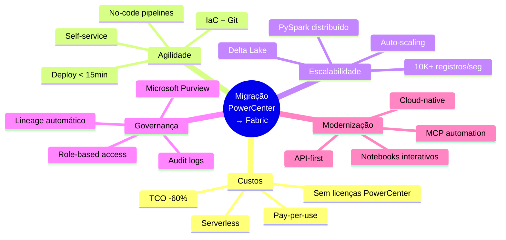
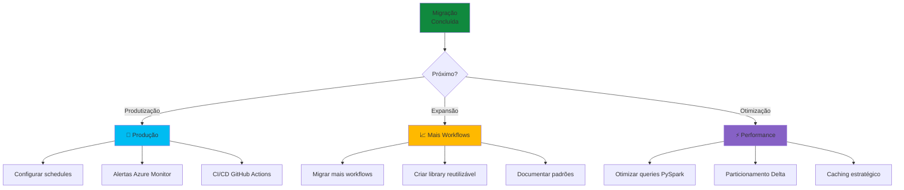

# 📊 Diagrama de Arquitetura — Migração PowerCenter → Fabric via MCP

## Fluxo de Migração End-to-End

---

## Arquitetura de Componentes

---

## Fluxo de Dados

---

## Timeline da Migração

**Duração total:** ~11 minutos

---

## Componentes Criados

---

## Mapeamento de Workflows

---

## Decisões de Arquitetura

| Aspecto | PowerCenter | Fabric | Justificativa |
|---------|-------------|--------|---------------|
| **Formato de dados** | XML → CSV | XML → CSV → Delta | Delta permite queries SQL e versionamento |
| **Orquestração** | Workflow Manager | Data Pipelines | Nativo do Fabric, sem infra adicional |
| **Transformação** | Mapplet | PySpark Notebook | Código versionável, testável, reutilizável |
| **Armazenamento** | File System | Lakehouse (OneLake) | Storage unificado, ACID, Delta Lake |
| **Scheduling** | pmcmd | Fabric Scheduler | Integrado, sem CLI externo |
| **Monitoramento** | Repository Manager | Azure Monitor | Observabilidade cloud-native |
| **Deploy** | Manual + Repo | MCP + Git | Automação, IaC, CI/CD |

---

## Benefícios da Migração

---

## Próximos Passos

---

**Última atualização:** 2026-06-23  
**Ferramenta:** Mermaid.js  
**Visualização:** GitHub / VS Code / Markdown viewers
